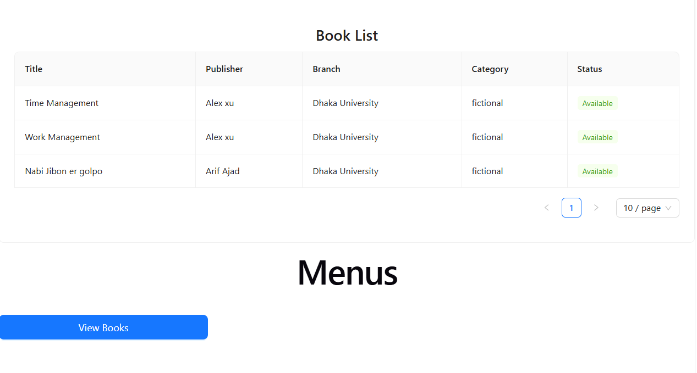
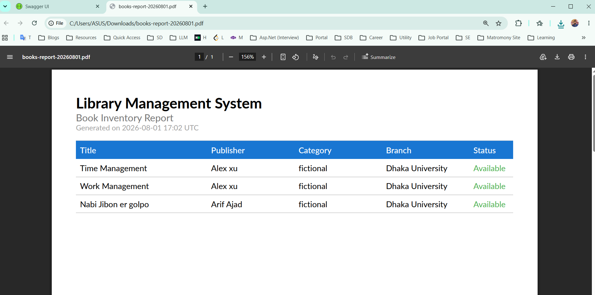

# [LMS (Library Management System)]

[This application consisted with multiple features focusing on the management of a library.]


---


## Architecture
```
┌─────────────────────────────┐
│        Presentation         │  ← Controllers, API endpoints
├─────────────────────────────┤
│         Application         │  ← Use cases, DTOs, interfaces, validation
├─────────────────────────────┤
│           Domain            │  ← Entities, enums, domain logic
├─────────────────────────────┤
│        Infrastructure       │  ← EF Core, repositories, external services
└─────────────────────────────┘

```
## Set Up Instructions 
## Backend
- Clone the repository
- Copy the `appsettings.json` file
- Create a database in local named `lms`
- Run the migrations file from the repository
- Then rebuild the application
- Then run the API project
- Then add some user role in the database `Role` table
- Then register as a new user
- Then log in with those credentials
- Then endpoints will be accessible


## Front End
- Clone the repository
- Then run these commands in terminal
- npm install
- npm run dev

Then open the given port in browser 


## Features Completed
## Backend
- Authentication via JWT 
- Full CRUD for Books management . Also books by branch and by category view
- Create, Update for branch
- Create, Update for category
- Create, Update for Loan ( Borrowing book)

## Frontend 
- Book List for All of the books


## Bonus Feature
- PDF generation for All of the books

## Assumptions and design decisions
- Architecture: Clean Architecture (To ensure proper organization, single responsibility, testability)
- Design Principles : SOLID (To ensure separation of concern)

- Design Patterns  : Unit of work (To ensure atomicity of operations) , Repository (To ensure single responsibility)
- Security : JWT Token

